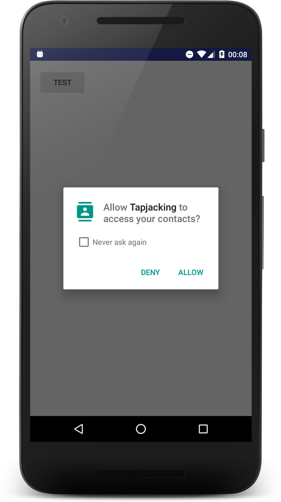
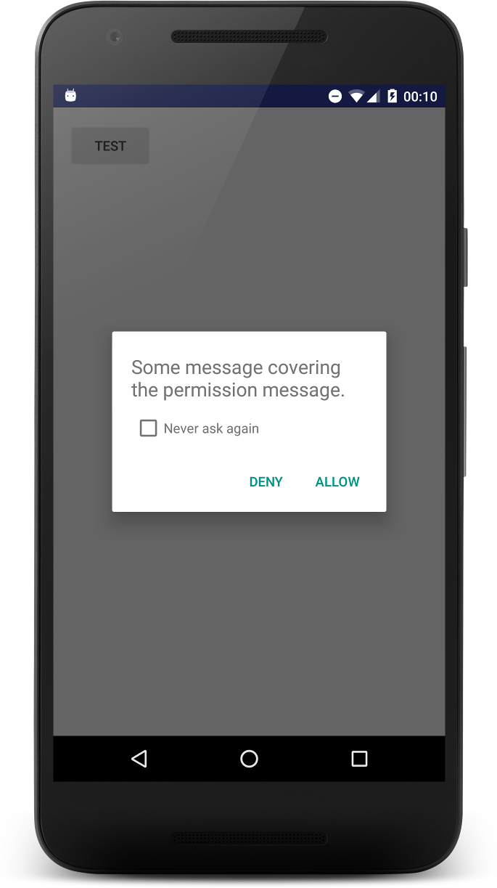

# Marshmallow Permissions Hijacking

This project demonstrates how Android Marshmallow permission dialog can be hijacked.

I reported very similar vulnerability to Google in May 2015 (ANDROID-21485727) but they failed to fix it.
I also submitted couple patches to AOSP ([gerrit](https://android-review.googlesource.com/#/c/157670/))
but they got ignored so I decided to share my findings here.

If you're maintaining some open-source ROM and you need more info on how to fix this vulnerability
feel free to create Issues with questions.

# Screenshots

## Contacts permissions dialog

## Hijacked dialog

